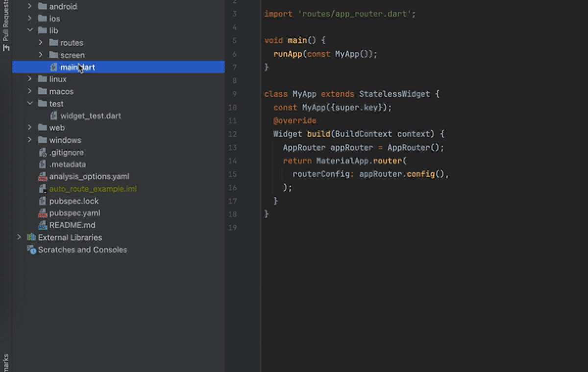

# flutter_tests_assistant

<!-- Plugin description -->
    Flutter Tests Assistant
      Features:
    
        - Support for creating and opening Dart test files
        - Mono-repo support
    
      Features Coming Soon!
    
        - Keep lib and test directories in sync after renaming or moving the file
        - Create test files with custom templates
  
    Not an official plugin.
<!-- Plugin description end -->

## Installation

- Using the IDE built-in plugin system:
  
  <kbd>Settings/Preferences</kbd> > <kbd>Plugins</kbd> > <kbd>Marketplace</kbd> > <kbd>Search for "flutter_tests_assistant"</kbd> >
  <kbd>Install</kbd>
  
- Manually:

  Download the [latest release](https://github.com/ProjectAJ14/flutter_tests_assistant/releases/latest) and install it manually using
  <kbd>Settings/Preferences</kbd> > <kbd>Plugins</kbd> > <kbd>⚙️</kbd> > <kbd>Install plugin from disk...</kbd>

## What's new?

See [CHANGELOG](CHANGELOG.md) to see what's new.

---
Plugin based on the [IntelliJ Platform Plugin Template][template].

[template]: https://github.com/JetBrains/intellij-platform-plugin-template
[docs:plugin-description]: https://plugins.jetbrains.com/docs/intellij/plugin-user-experience.html#plugin-description-and-presentation
